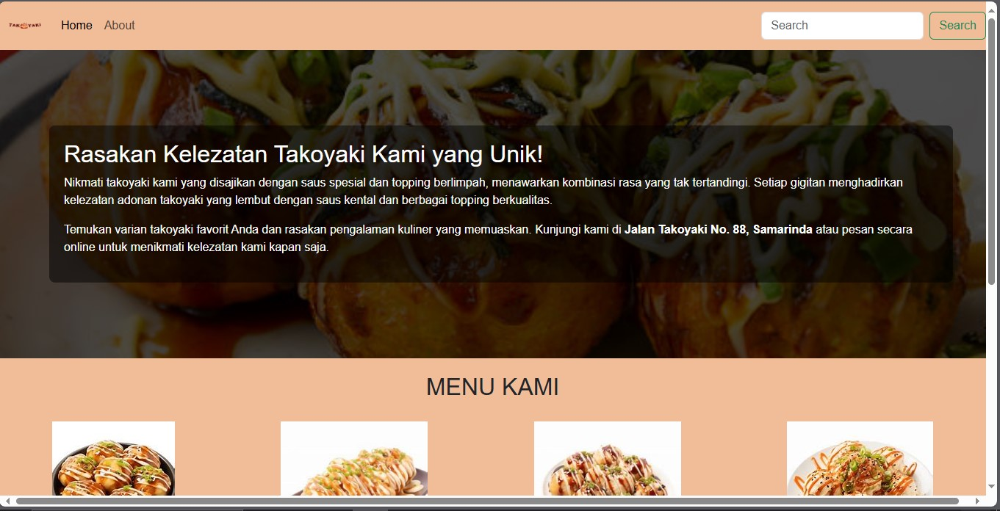
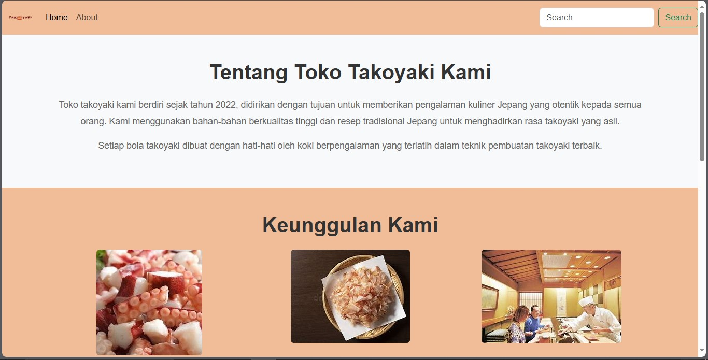

# Posttest1

### NAMA : Alianur

### NIM  : 2209106025

Markdown website Takoyaki Posttest 1

**Table of Contents:**

1. Halaman Layout.html
2. Halaman index.html(landing page)
3. Halaman about.html

## 1. Halaman Layout.html

## *Syntax*

### Navbar

```
 <nav class="navbar navbar-expand-lg">
      <div class="container-fluid">
        <a class="navbar-brand" href=""></a>
        <button class="navbar-toggler" type="button" data-bs-toggle="collapse" data-bs-target="#navbarSupportedContent" aria-controls="navbarSupportedContent" aria-expanded="false" aria-label="Toggle navigation"><span class="navbar-toggler-icon"></span></button>
        <div class="collapse navbar-collapse" id="navbarSupportedContent">
          <ul class="navbar-nav me-auto mb-2 mb-lg-0">
            <li class="nav-item">
              <a class="nav-link active" aria-current="page" href="">Home</a>
            </li>
            <li class="nav-item">
              <a class="nav-link" href="">About</a>
            </li>
          </ul>
          <form class="d-flex">
            <input class="form-control me-2" type="search" placeholder="Search" aria-label="Search" style="margin-right: 20px;" />
            <button class="btn btn-outline-success" type="submit">Search</button>
          </form>
        </div>
      </div>
    </nav>
```

Ini adalah kode untuk bagian navbar, untuk penjelasan lebih detail dapat dilihat dibawah ini.

```
 <a class="navbar-brand" href=""></a>
```

kode bagian ini adalah bagian logo pada navbar. Selain itu terdapat juga unordered list yg berisi list sebagai berikut.

1. Home
2. about
3. search(belum digunakan)

#### Home

berikut kode navbar untuk bagian home

```
<li class="nav-item">
    <a class="nav-link active" aria-current="page" href="">Home</a>
</li>
```

#### About

Berikut kode navbar untuk bagian about

```
 <li class="nav-item">
    <a class="nav-link" href="">About</a>
  </li>
```

#### Search

Berikut kode navbar bagian search

```
 <form class="d-flex">
            <input class="form-control me-2" type="search" placeholder="Search" aria-label="Search" style="margin-right: 20px;" />
            <button class="btn btn-outline-success" type="submit">Search</button>
          </form>
```

### Footer

Selain berisi navbar, layout.html juga berisi footer yang mengandung informasi toko seperti kontak, alamat, email, dan sosial media. Kode footer dapat dilihat pada kode dibawah ini.

```
  <footer class="footer text-white py-4 mt-5">
        <div class="container">
          <div class="row">
            <!-- Kontak -->
            <div class="col-md-4">
              <h5>Kontak Kami</h5>
              <p>
                Email: <a href="mailto:info@takoyakistore.com" class="text-white">info@takoyakistore.com</a>
              </p>
              <p>
                No. HP: <a href="tel:+628123456789" class="text-white">+62 812 3456 789</a>
              </p>
            </div>

            <!-- Lokasi Toko -->
            <div class="col-md-4">
              <h5>Lokasi Toko</h5>
              <p>Jalan Takoyaki No. 88, Samarinda</p>
            </div>

            <!-- Social Media -->
            <div class="col-md-4">
              <h5>Ikuti Kami</h5>
              <a href="https://www.facebook.com" class="me-3" target="_blank"></a>
              <a href="https://www.twitter.com" class="me-3" target="_blank"></a>
              <a href="https://www.instagram.com" target="_blank"></a>
            </div>
          </div>
        </div>
      </footer>
```

## 2. Halaman index.html

## *Syntax*

```



  Home


  <link rel="stylesheet" href="" />

  <section class="takoyaki-section">
    <div class="takoyaki-text">
      <h2>Rasakan Kelezatan Takoyaki Kami yang Unik!</h2>
      <p>Nikmati takoyaki kami yang disajikan dengan saus spesial dan topping berlimpah, menawarkan kombinasi rasa yang tak tertandingi. Setiap gigitan menghadirkan kelezatan adonan takoyaki yang lembut dengan saus kental dan berbagai topping berkualitas.</p>
      <p>
        Temukan varian takoyaki favorit Anda dan rasakan pengalaman kuliner yang memuaskan. Kunjungi kami di <strong>Jalan Takoyaki No. 88, Samarinda</strong> atau pesan secara online untuk menikmati kelezatan kami kapan saja.
      </p>
    </div>
  </section>

  <section class="menu-section">
    <h2 class="text-center">MENU KAMI</h2>
    <div id="carouselExampleControls" class="carousel slide" data-bs-ride="carousel">
      <div class="carousel-inner">
        <!-- First Slide -->
        <div class="carousel-item active">
          <div class="d-flex justify-content-around">
            <div class="carousel-image-container text-center">
              
              <div class="carousel-caption">
                <h5>Takoyaki Original</h5>
                <p>Rp 25,000</p>
              </div>
            </div>
            <div class="carousel-image-container text-center">
              
              <div class="carousel-caption">
                <h5>Takoyaki Pedas</h5>
                <p>Rp 27,000</p>
              </div>
            </div>
            <div class="carousel-image-container text-center">
              
              <div class="carousel-caption">
                <h5>Takoyaki Spesial</h5>
                <p>Rp 40,000</p>
              </div>
            </div>
            <div class="carousel-image-container text-center">
              
              <div class="carousel-caption">
                <h5>Takoyaki Mayonaise</h5>
                <p>Rp 30,000</p>
              </div>
            </div>
          </div>
        </div>
        <!-- Second Slide -->
        <div class="carousel-item">
          <div class="d-flex justify-content-around">
            <div class="carousel-image-container text-center">
              
              <div class="carousel-caption">
                <h5>Takoyaki Gurita</h5>
                <p>Rp 35,000</p>
              </div>
            </div>
            <div class="carousel-image-container text-center">
              
              <div class="carousel-caption">
                <h5>Takoyaki Sosis</h5>
                <p>Rp 28,000.000</p>
              </div>
            </div>
            <div class="carousel-image-container text-center">
              
              <div class="carousel-caption">
                <h5>Takoyaki Keju</h5>
                <p>Rp 32,000</p>
              </div>
            </div>
            <div class="carousel-image-container text-center">
              
              <div class="carousel-caption">
                <h5>Takoyaki Udang</h5>
                <p>Rp 34,000</p>
              </div>
            </div>
          </div>
        </div>
      </div>
      <button class="carousel-control-prev" type="button" data-bs-target="#carouselExampleControls" data-bs-slide="prev">
        <span class="carousel-control-prev-icon" aria-hidden="true"></span>
        <span class="visually-hidden">Previous</span>
      </button>
      <button class="carousel-control-next" type="button" data-bs-target="#carouselExampleControls" data-bs-slide="next">
        <span class="carousel-control-next-icon" aria-hidden="true"></span>
        <span class="visually-hidden">Next</span>
      </button>
    </div>
  </section>

  <!-- Button Beli Section -->
  <div class="text-center mt-4">
    <button class="btn-beli">Beli</button>
  </div>


```

Didalam index.html terdapat 2 section. yaitu takoyaki-section dan menu-section. takoyaki-section berupa latar belakang dalam bentuk foto yang didepannya berisi teks berupa slogan promosi dari toko. Sedangkan menu-section berisi carousel yang menampilkan beberapa menu yang disedikan toko tersebut dan tombol beli yang nanti nya akan mengarahkan ke halaman menu.

## Screenshot tampilan index.html



## 3. Halaman about.html

Halaman about.html berisi 3 section, yaitu tentang kami, keunggulan, dan testimoni pelanggan.

## *Syntax*

### Tentang toko

Berisi detail kecil mengenai toko seperti sejarah dan tujuan pembuatan toko tersebut.

```
<section class="about-section bg-light py-5">
    <div class="container text-center">
      <h2 class="mb-4">Tentang Toko Takoyaki Kami</h2>
      <p>Toko takoyaki kami berdiri sejak tahun 2022, didirikan dengan tujuan untuk memberikan pengalaman kuliner Jepang yang otentik kepada semua orang. Kami menggunakan bahan-bahan berkualitas tinggi dan resep tradisional Jepang untuk menghadirkan rasa takoyaki yang asli.</p>
      <p>Setiap bola takoyaki dibuat dengan hati-hati oleh koki berpengalaman yang terlatih dalam teknik pembuatan takoyaki terbaik.</p>
    </div>
  </section>
```

### Keunggulan

Berisi hal-hal yang menjadi kan toko kami lebih unggul dan menarik dibandingkan toko Takoyaki lainnya.

```
 <section class="about-section py-5">
    <div class="container text-center">
      <h2 class="mb-4">Keunggulan Kami</h2>
      <div class="row">
        <div class="col-md-4">
          
          <h4>Bahan Segar</h4>
          <p>Kami hanya menggunakan bahan-bahan segar dan berkualitas tinggi untuk setiap porsi takoyaki yang kami buat.</p>
        </div>
        <div class="col-md-4">
          
          <h4>Rasa Otentik</h4>
          <p>Resep kami adalah resep asli Jepang yang memberikan cita rasa takoyaki otentik dengan saus khas yang lezat.</p>
        </div>
        <div class="col-md-4">
          
          <h4>Layanan Terbaik</h4>
          <p>Kami berkomitmen untuk memberikan pelayanan terbaik kepada pelanggan, dengan fokus pada kualitas dan kepuasan pelanggan.</p>
        </div>
      </div>
    </div>
  </section>
```

### Testimoni pelanggan

Berisi testimoni dari para pelanggan yang sudah pernah merasakan produk takoyaki dari toko kami

```
 <section class="about-section bg-light py-5">
    <div class="container text-center">
      <h2 class="mb-4">Apa Kata Pelanggan Kami?</h2>
      <div class="row">
        <div class="col-md-4">
          <blockquote class="blockquote">
            <p class="mb-0">"Takoyaki terenak yang pernah saya coba, rasanya benar-benar otentik!"</p>
            <footer class="blockquote-footer">Budi, Pelanggan Tetap</footer>
          </blockquote>
        </div>
        <div class="col-md-4">
          <blockquote class="blockquote">
            <p class="mb-0">"Pelayanan yang ramah dan cepat, takoyaki mereka selalu disajikan segar."</p>
            <footer class="blockquote-footer">Sinta, Pecinta Takoyaki</footer>
          </blockquote>
        </div>
        <div class="col-md-4">
          <blockquote class="blockquote">
            <p class="mb-0">"Tempat yang sempurna untuk menikmati takoyaki bersama keluarga"</p>
            <footer class="blockquote-footer">Rahmat, Pelanggan Baru</footer>
          </blockquote>
        </div>
      </div>
    </div>
  </section>
```
## Screenshot tampilan about.html


